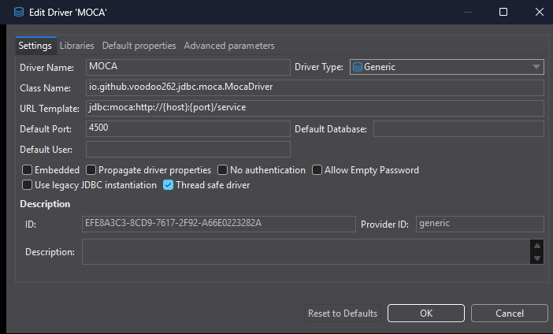
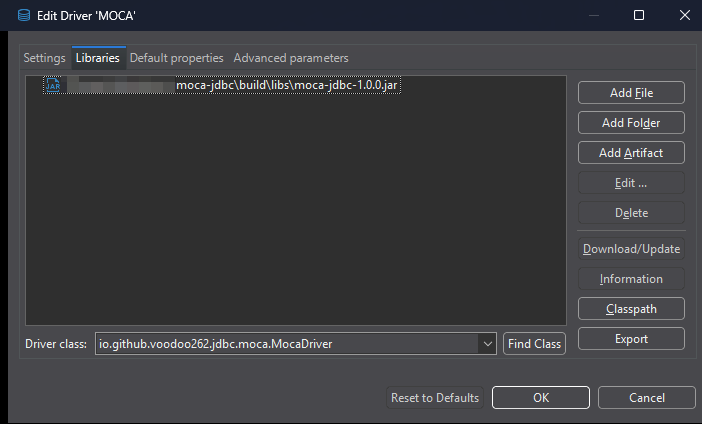
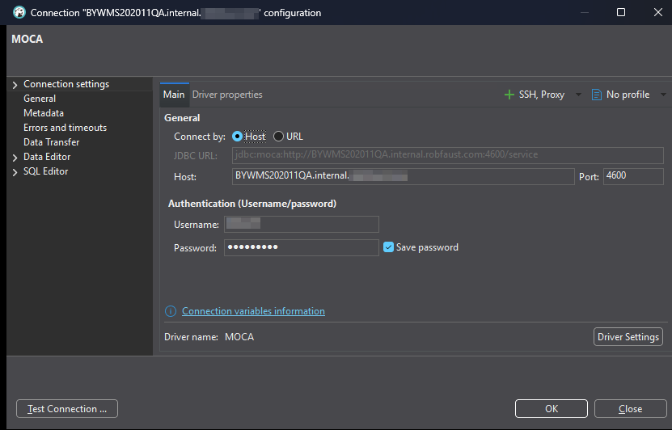
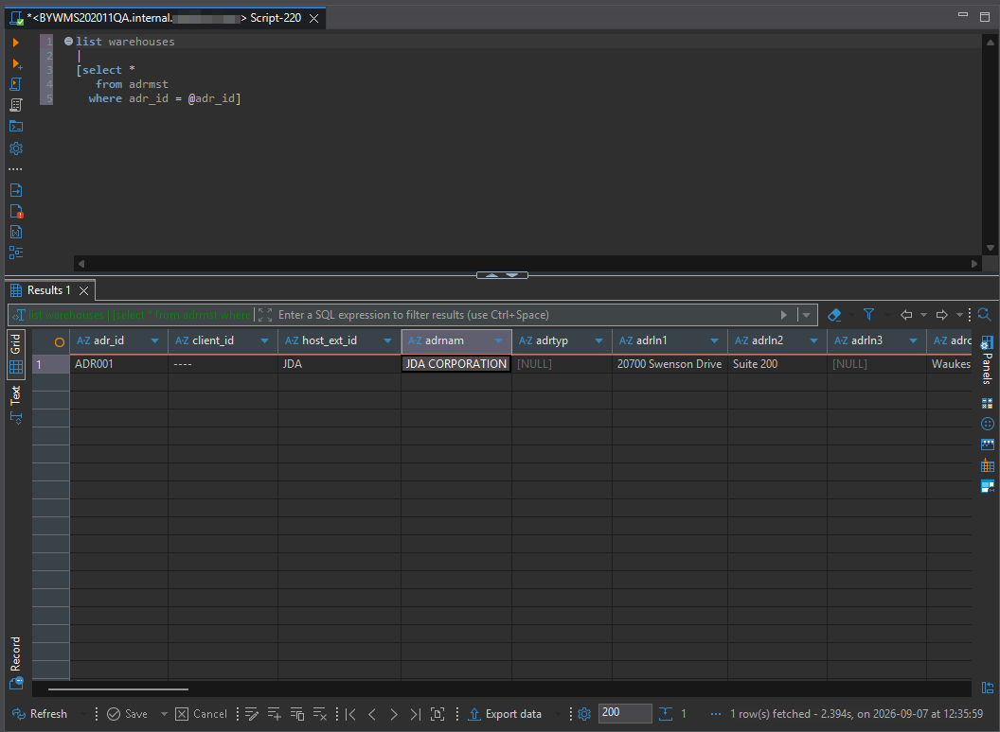
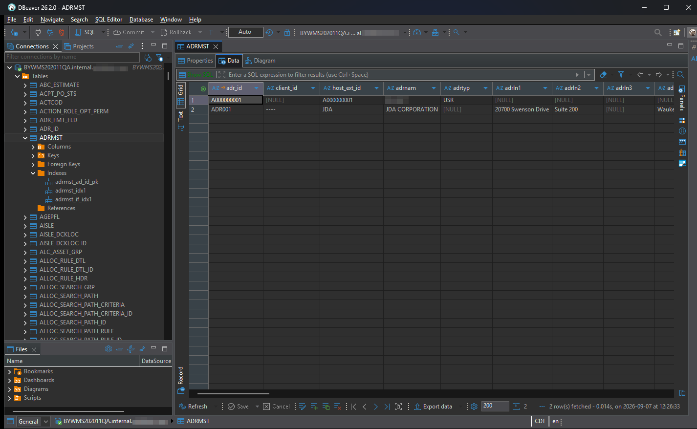

# moca-jdbc

[](https://github.com/Voodoo262/moca-jdbc/actions/workflows/ci.yml?query=branch%3Amain)
[](https://github.com/Voodoo262/moca-jdbc/releases)
[](LICENSE)

A JDBC driver for the **MOCA** command protocol (RedPrairie / JDA / Blue Yonder).

MOCA is a command language, not SQL, and it has no JDBC driver of its own — so tools like
DBeaver, DataGrip, JMeter and Spring can't talk to a MOCA server. This driver wraps MOCA's
HTTP protocol (`application/moca-xml`) behind `java.sql.Driver` so that any JDBC client can.

It is a **single self-contained jar with no dependencies** — everything it needs (HTTP
client, XML parsing, logging) comes from the JDK. Drop it into DBeaver's Driver Manager and
it works.

```java
try (Connection conn = DriverManager.getConnection(
         "jdbc:moca:http://host:4500/service", "user", "password");
     Statement stmt = conn.createStatement();
     ResultSet rs = stmt.executeQuery("list warehouses"))
{
    while (rs.next())
    {
        System.out.println(rs.getString("wh_id"));
    }
}
```

The driver registers itself through `META-INF/services/java.sql.Driver`, so `Class.forName`
is not needed on any JDBC 4.0+ runtime.

## Install

Download `moca-jdbc-<version>.jar` from the
[latest release](https://github.com/Voodoo262/moca-jdbc/releases/latest) and put it on your
classpath, or point your tool's driver manager at it.

There are deliberately **no Maven or Gradle coordinates**. The install path this driver is
built for is "download one jar and point DBeaver at it", and a registry that needs
credentials to read from would get in the way of exactly that. Sources and Javadoc jars are
attached to each release alongside the driver.

Java 17 or newer.

## Connection URL

```
jdbc:moca:http://host:4500/service
jdbc:moca:https://host/service
jdbc:moca://host:4500/service          # scheme defaults to http
```

| Property | Required | Default | Meaning |
|---|---|---|---|
| `user` | yes | — | MOCA user id |
| `password` | yes | — | MOCA password |
| `localeId` | no | server default | `LOCALE_ID` set on each command, e.g. `US_ENGLISH` |
| `connectTimeout` | no | `10000` | TCP connect timeout, in milliseconds |
| `readTimeout` | no | `60000` | Response timeout, in milliseconds. `Statement.setQueryTimeout` overrides it per command. |

Properties can be passed to `DriverManager` or appended to the URL as query parameters
(`?localeId=US_ENGLISH&readTimeout=5000`); the ones passed to `DriverManager` win.

If you do put `password` in the URL, note that `DatabaseMetaData.getURL()` blanks it out
before returning — that value is displayed and logged in too many places to carry a
credential.

## Using it from DBeaver

No plugin is required — the driver loads as a generic JDBC driver.

1. **Database → Driver Manager → New**
2. On the **Settings** tab, fill in:
   - Driver name: `MOCA`
   - Class name: `io.github.voodoo262.jdbc.moca.MocaDriver`
   - URL template: `jdbc:moca:http://{host}:{port}/service`
   - Default port: `4500`

   Both transports are supported. For HTTPS, use
   `jdbc:moca:https://{host}:{port}/service` as the template instead — or set the template
   to `jdbc:moca://{host}:{port}/service`, which defaults to HTTP, and type the full URL on
   connections that need HTTPS.

   <!-- SCREENSHOT: DBeaver "Create new driver" dialog, Settings tab, with Driver Name,
        Class Name, URL Template and Default Port filled in exactly as above. -->
   

3. On the **Libraries** tab, **Add File** and select `moca-jdbc-<version>.jar`. DBeaver
   should find `io.github.voodoo262.jdbc.moca.MocaDriver` when you click **Find Class**.

   <!-- SCREENSHOT: Libraries tab with the jar listed and the driver class resolved in the
        class list below it. -->
   

4. Create a connection with that driver and fill in host, port, user and password.

   <!-- SCREENSHOT: the connection settings dialog for the new MOCA driver, with a
        placeholder host such as moca.example.com. No real hostname or password. -->
   

5. Open a SQL editor against the connection. MOCA commands run as-is.

   <!-- SCREENSHOT: SQL editor with `list warehouses` executed and the results grid
        populated. -->
   

6. The Database Navigator lists tables, and viewing one runs a bracketed `SELECT` against
   the database underneath — see [Catalog browsing](#catalog-browsing) below.

   <!-- SCREENSHOT: Database Navigator tree expanded to show the table list. -->
   

## How MOCA maps onto JDBC

MOCA and JDBC disagree in a few places. Where they do, the driver follows **JDBC**, because
that is what a JDBC caller is written against.

- **Columns are 1-based**, as JDBC mandates and every tool assumes. MOCA's own wire format
  is positional and 0-based; the conversion happens in exactly one place.
- **"No rows" is not an error.** MOCA reports a query that matched nothing as status `510`.
  In JDBC that is an *empty `ResultSet`*, not an exception, so the driver returns one — still
  carrying the column list MOCA sends with it, so the empty result stays properly typed.
  Otherwise every empty table would pop an error dialog.
- **Unsupported operations throw `SQLFeatureNotSupportedException`**, never
  `UnsupportedOperationException`. A JDBC caller catches `SQLException`; an unchecked throw
  from a driver takes the host application down with it.
- **Server errors become `SQLException`** with the MOCA status as the vendor code
  (`getErrorCode()`) and a standard `SQLState` — `42601` for a syntax error (505), `02000`
  for no rows (510), `42703` for an invalid column (511), `42000` for an unknown command
  (501). DBeaver keys its error reporting off `SQLState`.
- **Result sets are scroll-insensitive and read-only.** A MOCA response arrives whole, so
  scrolling backwards is free. There is no updatable cursor.
- **Transactions** are the MOCA `commit` / `rollback` commands, driven by
  `setAutoCommit(false)`. Closing a connection with an open transaction rolls it back, and
  closes the statements that connection handed out.
- **`?` parameters are inlined client-side.** MOCA has no bind-parameter protocol — a command
  is just a string — so `PreparedStatement` renders parameters into MOCA literal syntax
  before sending. Strings are single-quoted with embedded quotes doubled. See the security
  note below.

## Catalog browsing

The Database Navigator is populated from MOCA's own catalog commands, not from the database
underneath:

| JDBC | MOCA command |
|---|---|
| `getTables()` | `list user tables description` |
| `getColumns()` | `list table columns where table = '<table>'` |
| `getIndexInfo()`, `getPrimaryKeys()` | `list table indexes where table = '<table>'` |

Column types come from `comtyp`, which is MOCA's own single-character type — the same
vocabulary the response metadata uses — so they map onto `java.sql.Types` directly rather
than being guessed from a native SQL type name. Column descriptions (`lngdsc`) and table
descriptions become JDBC `REMARKS`.

`list table indexes` describes an index in prose rather than as flags
(`clustered, unique, primary key located on primary`), so uniqueness, clustering and which
index is the primary key are read back out of that text, and `index_keys` gives the key
order that `KEY_SEQ` needs.

Two things follow from these commands taking no pattern of their own:

- **The JDBC table/column name patterns are applied client-side.** `%` and `_` work as JDBC
  specifies. Matching ignores case, because the commands themselves disagree — `list table
  columns` answers in lower case and `list table indexes` in upper.
- **`getColumns()` with a wildcard is one command per matching table.** Asking for `%` on a
  thousand-table schema is a thousand round trips. Tools ask per-table when expanding a
  tree, which is the case this is tuned for.

`list user tables description` is used in preference to plain `list user tables` because it
carries the description. It is meaningfully slower (roughly 0.8s versus 0.05s against a
thousand-table schema), which is a fair trade on a tree expand.

Every catalog query is wrapped so that a failure yields an *empty* result rather than an
exception — a tool browsing the tree degrades to "no tables" instead of erroring out. If
browsing comes back empty, check that the MOCA user's role can run these commands.

Foreign keys, schemas, catalogs and stored procedures are not reachable through MOCA, and
their metadata methods return correctly-shaped empty result sets, as JDBC requires.

## Running SQL against the database underneath

MOCA passes a bracketed statement straight through to the Oracle or SQL Server database it
runs on:

```
[select * from poldat]
```

A JDBC tool does not know that, so the driver **wraps a bare `SELECT` in brackets for you**.
`select * from poldat` is sent as `[select * from poldat]`, which is what makes
double-clicking a table in DBeaver's navigator work. A trailing semicolon is dropped.

Only a command that starts with the word `select` is touched, and only when it is not
already bracketed — every MOCA command starts with a verb (`list`, `publish`, `get`, ...),
so there is nothing for this to collide with. `Connection.nativeSQL()` reports the same
transformation.

## Security

### Use `https`

`jdbc:moca://host/service` defaults to plain **http**, and the MOCA password is sent in the
login request body. Over `http`, that password and every command and result travel in
cleartext. Use `https` for anything that leaves a trusted network.

### `PreparedStatement` escapes, it does not bind

Because MOCA has no bind protocol, parameter values are **interpolated into the command text**.
The escaping in `MocaPreparedStatement.quote` is therefore security-relevant, not cosmetic: it
is the only thing between an untrusted value and executable command text. Strings are wrapped
in single quotes with embedded quotes doubled, which is MOCA's own escape, and this is covered
by a test that attempts an injection.

That said, escaping is a weaker guarantee than real parameter binding. **Do not build MOCA
commands from untrusted input** if you can avoid it.

The same applies to the table name passed to `getColumns()` / `getIndexInfo()` /
`getPrimaryKeys()`, which is interpolated into the `where` clause of a MOCA catalog command
and is escaped the same way. MOCA's command separator is `&`, which is harmless inside a
quoted literal but not outside one.

### Responses are parsed with doctypes disabled

The response parser refuses `DOCTYPE` declarations outright, which closes XXE and entity
expansion together. A response is network input from a server the driver does not control.

## Not supported

`CallableStatement`, batch execution, savepoints, generated keys, updatable result sets,
transaction isolation levels, `cancel()` (the MOCA HTTP protocol has no cancel channel), and
BLOB/CLOB/ARRAY/REF/SQLXML values. Each throws `SQLFeatureNotSupportedException`.

Only the **HTTP** transport is implemented. MOCA's legacy socket protocol is not.

## Build

```sh
./gradlew build        # compile, test, jar
./gradlew test         # tests only
```

Java 17 or newer to run the driver; the build compiles at release level 17 on any newer JDK.

The tests need no live MOCA server: they run the driver end-to-end over real HTTP against a
fake MOCA server built on the JDK's own `HttpServer`.

## Credits

Inspired by [`labelzoom-moca-client-java`](https://github.com/labelzoom/labelzoom-moca-client-java),
which is where this started and which remains the better choice if you want a plain MOCA
client rather than a JDBC driver.

This driver is a separate implementation rather than a wrapper around it, because a JDBC
driver needs things a general client does not: 1-based columns, `SQLException` on every
failure path, per-statement timeouts, and no transitive dependencies to conflict with the
host application's classpath.

The two overlap in the MOCA request/response XML format, which is the shared contract — a
change in how MOCA frames a request or response has to be applied in both places.

## License

MIT — see [LICENSE](LICENSE).
